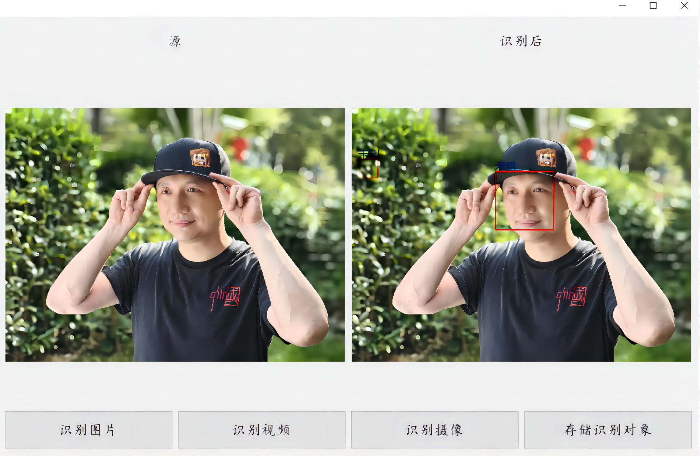

<h1 align="center">
基于OpenCV的人脸识别
</h1>

*本项目为作业项目*

该程序为基于`OpenCV`编写的人脸识别程序，实现了对图片，视频，摄像头图像中的人脸进行识别，与识别特定的人脸，在屏幕上显示其信息。

程序水平不高，主要是为了完成作业做一个留档（升级电脑差点给作业都给干没咯）

## 运行需求
- python >= 3.9（本项目基于Python 3.9开发）
- 支持CUDA的显卡

## 运行截图

程序中可能会出现问题，除非没事干一般不修复：
- 命名不规范
- 代码冗余
- 程序效率不高
- 当识别的图片像素量过高的时候，会导致识别框过小
- 识别视频中人脸时，不能调用cuda，纯粹使用cpu运算